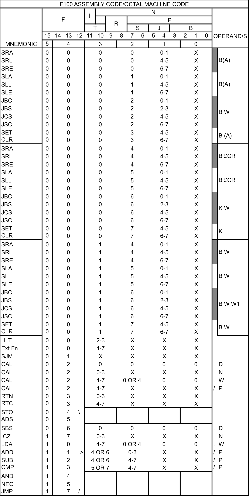
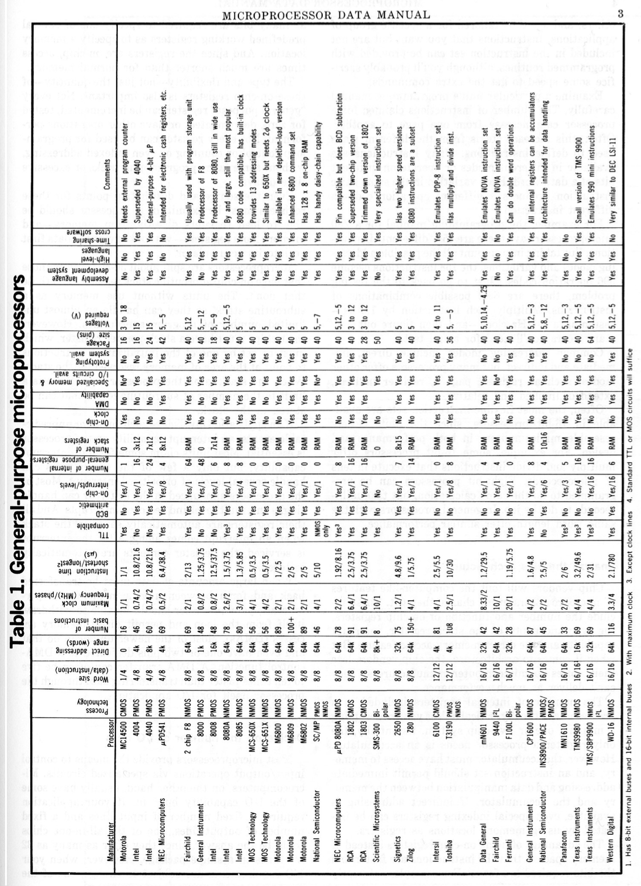

==========
Appendices
==========

Appendix1_ - The F100-L Microcomputer Control Handset

Appendix2_ - F100-L Handset Assembly Language Summary

Appendix3_ - Comparison Table of Contemporary Microprocessors

Appendix4_ - One Page Ferranti F100L Datasheet

Appendix5_ - F100-L Family Silicon Photo Gallery

.. _Appendix1:

Appendix 1 - The F100-L Microcomputer Control Handset
-----------------------------------------------------

A handset from the F100-L microcomputer, originally from an installation in
HMS Dryad, is held in the collection at the Centre for Computing
History, Cambridge, UK: Box704_.

.. _Box704: http://www.computinghistory.org.uk/det/16974/Box-704-Ferranti-Marconi/

.. image:: ./F100L_Handset.png

Additional photos in higher resolutions are available from my smugmug photo sharing website_

.. _website: https://revaldinho.smugmug.com/Vintage-Technology/Ferranti-F100-Project/n-VXHdXd

.. _Appendix2:

Appendix 2 - F100-L Handset Assembly Language Summary
-----------------------------------------------------

The following table is a transcript from the back of the F100-L microcomputer
controller handset

.. _Appendix3:

Appendix 3 - Comparison Table of Contemporary Microprocessors
-------------------------------------------------------------

The following table is reproduced from [15]

.. _Appendix4:

Appendix 4 - One Page Ferranti F100-L Datasheet
-----------------------------------------------

The following datasheet is reproduced from [15]

.. image:: ./F100OnePageData.png

.. _Appendix5:

Appendix 5 - F100-L Family Silicon Photo Gallery
------------------------------------------------

Full size versions of these photographs are available on Smugmug_

.. _Smugmug: https://revaldinho.smugmug.com/Vintage-Technology/Integrated-Circuits/Ferranti-F100-and-Related-ICs

*Ferranti F100-L CPU*

.. figure:: ./F100_32mm_1.5X_GX7_DxO.jpg

   Ferranti F100L AJ BSS2 FRD 8630

   Die measures approximately 5.8mm x 5.8mm

*F113 High Speed Memory interface chip.*
   
.. figure:: ./Ferranti_F113_ULA.jpg

   GPS F113LAJ CS 9522A

   Implemented on a ZNA2068 ULA, with an array of 15x15 logic elements.
   
   Chip Die measures approximately 3mm x 3mm.

*F115 Real Time Interrupt chip.*

.. figure:: ./F115_5X_1.5X_GX7_DxO.jpg

   Ferranti F115L AJ BSS2 FRD 8636

   Die size: approx 3.3mm x 3.3mm.

*Detail of ULA 2000 series bipolar gate array elements on the F113*

.. figure:: ./F113_Detail_10X_1.5X_GX7_DxO_DxO.jpg

