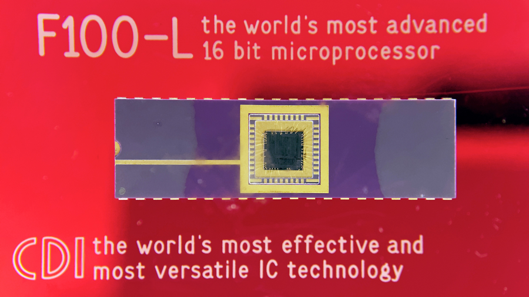

.. F100L documentation master file, created by
   sphinx-quickstart on Fri Nov 25 21:28:51 2016.
   You can adapt this file completely to your liking, but it should at least
   contain the root `toctree` directive.

Welcome to the F100-L Project
=============================

Contents:

.. toctree::
   :titlesonly:
   :maxdepth: 2

   doc/F100Project
   doc/F100CPU
   doc/F100Arch
   doc/F100InstrSet
   doc/F100Asm
   doc/F100Emu
   doc/References
   doc/Appendices
   doc/license

Indices and tables
==================

* :ref:`genindex`
* :ref:`modindex`
* :ref:`search`
